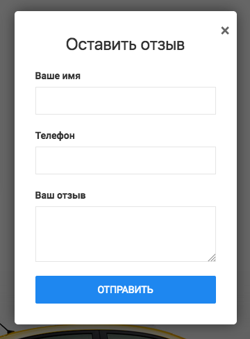
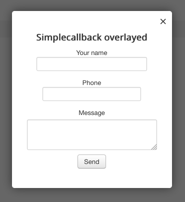

#Simple Callback Module#
Простой модуль обратного звонка или для обратной связи. Совместим с Joomla 3.0 и выше.
При необходимости дополняется компонентом [Simple Callback Component](https://github.com/birdkiwi/com_simplecallback/releases/), для сохранения сообщений в панели администрирования.





Демо: [joomla.startler.ru](http://joomla.startler.ru/)

 :paperclip: Скачать модуль: [Все версии](https://github.com/birdkiwi/mod_simplecallback/releases/)
 :paperclip: Скачать компонент: [Все версии](https://github.com/birdkiwi/com_simplecallback/releases/)

**Основные преимущества:**

 1. Бесплатный
 2. Безопасный: поддержка токенов ([CSRF](https://docs.joomla.org/How_to_add_CSRF_anti-spoofing_to_forms)) капчи и honneypot.
 3. Без перезагрузки страницы (ajax).
 4. SMS-уведомления с помощью сервиса SMS.ru (бесплатно, в случае отправки на один телефон)
 5. Возможность вставки нескольких модулей на одну страницу
 6. Содержит все необходимые настройки

**Возможности:**

Модуль поддерживает несколько видов отображения на странице:

 - *Как обычный модуль* —  форма вставляется в указанную позицию
 - *Как оверлей* — код формы вставлен в позицию, но сама форма скрыта. Вызвать
   форму можно с любой кнопки на странице с аттрибутом
   **data-simplecallback-open**, например:

```html
<a href="#" data-simplecallback-open>
    Обратная связь
</a>
```

В коде сверху вызовется самый первый модуль с оверлеем. Если на странице размещается сразу несколько модулей, то вызвать нужный можно указав ID модуля в аттрибуте **data-simplecallback-open**, например:

```html
<a href="#" data-simplecallback-open="93">
    Обратный звонок
</a>
```

Альтернативный способ открытия — использование хэш ссылки. Может быть полезным, если вы хотите сделать кнопку обратного звонка в меню Joomla.

```html
<a href="#simplecallback-93">
    Обратный звонок
</a>
```

Закрыть оверлей можно любой кнопкой/ссылкой с атрибутом **data-simplecallback-close**, пример:

```html
<a href="#" data-simplecallback-close>
    Закрыть [x]
</a>
```

Еще вызвать модуль можно через JS:

```javascript
/* показать оверлей с модулем по id */
    simplecallback.show(id); 
/* скрыть оверлей с модулем */
    simplecallback.hide(); 
```

**Передача скрытого текста:**

Иногда возникает ситуация: вам необходимо понимать с какой кнопки был совершен обратный звонок. Для этого можно использовать атрибут **data-simplecallback-custom-data**. Значение этого атрибута будет указано в письме. Может быть полезно, например, если у вас множество товаров на странице и на всех есть кнопка быстрого заказа.

```html
<a href="#" data-simplecallback-open="93" data-simplecallback-custom-data="Купить iPhone 6">
    Купить в 1 клик
</a>
```

**Дизайн, шаблоны и пр:**

Модуль создан без особого прицела на визуальный дизайн, т.к. дизайн каждого сайта индивидуален, поэтому вам предоставляется полная свобода для оформления и верстки. 

Для того, чтобы создать свой шаблон, создайте директорию _/templates/название-вашего-шаблона/html/mod_simplecallback/_ и добавьте туда копию файла **default.php** из директории _/modules/mod_simplecallback/tmpl/default.php_. Вы можете создать разные шаблоны в папке вашего шаблона и выбирать их из панели администрирования в настроке модуля «Альтернативный макет».

**Рекомендации по настройке:**

Настоятельно рекомендуется настроить в общих настройках Joomla отправку писем не через PHP Mail, а через SMTP-сервер. Это уменьшит шанс того, что ваше письмо попадет в спам или вовсе будет удалено на вашем почтовом ящике фильтрами.
  
Система — Общие настройки — Сервер — Способ отправки: SMTP

Для SMTP рекомендуется завести отдельный ящик, в целях безопасности, т.к. SMTP пароли в Joomla хранятся в открытом виде. В случае компрометации Joomla ваш основной ящик не пострадает!